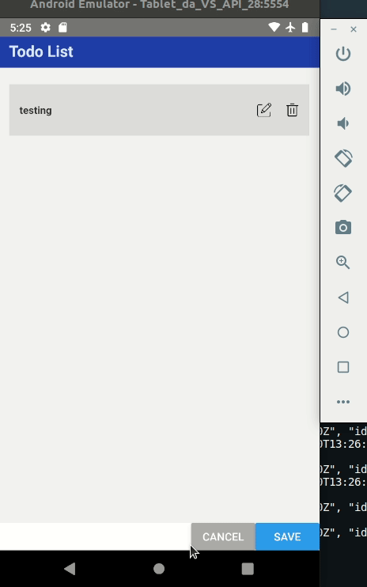
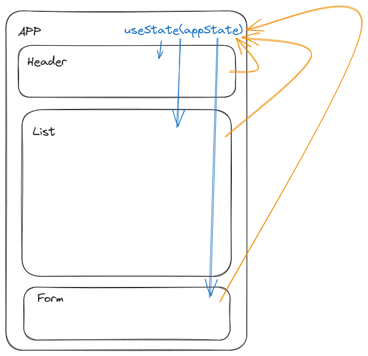

# React Native Todolist

In October 2023, I embarked on a journey to study React Native, a versatile hybrid platform app development framework. 
To put my newly acquired knowledge to the test, I created a simple CRUD (Create, Read, Update, Delete) "Todo List" application.

## Components

## Review

 Pros:

    - Utilizes Typescript for generating a native app.
    - Boasts good official documentation, making it easy to learn.
    - Embraces functional programming paradigms.
    - Offers a styling language similar to CSS.

 Cons:

    - Debugging can be challenging.
    - Lacks a built-in style framework.
    - Lacks built-in persistent storage.
    - Colleagues accustomed to C# and Java may find it unconventional due to its functional nature.

